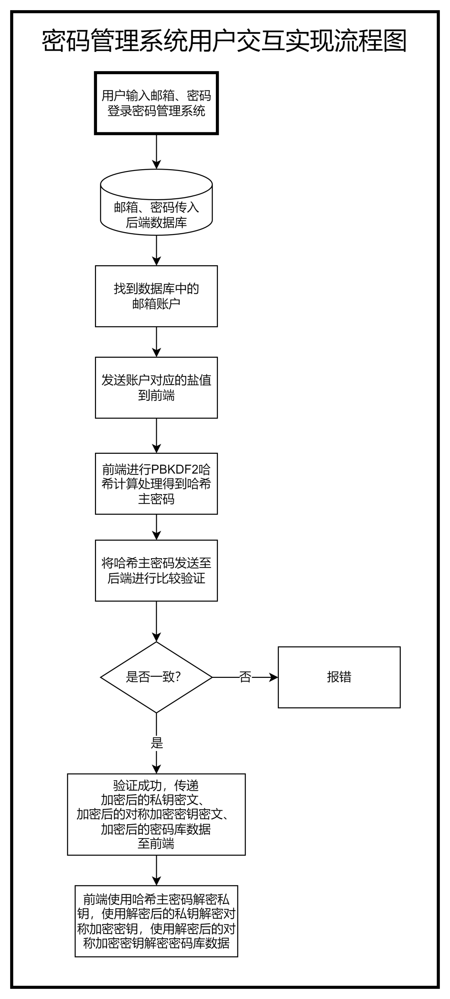

# Passwordmanager密码管理器
## 如何运行

后端:配置好`db.js`文件，然后运行
>数据库使用的是mysql,表名一个是users，一个是acounts，得自己创建，之前经常用的navicat因为太久没用烂了，数据库创建删除什么的都是手打的QAQ
```
npm install
node server.js
```
前端:
```
npm install
npm run dev
```
>README之后全内容除了图是组员画的，其他都是ai写的，不过这个项目是我在一天时间里写出来的并且由于我很久没有写项目了,所以很多地方还有瑕疵，很多地方也不是很规范。加密过程还是比较难写的，到最后也没有完全写完，答辩的时候也是敷衍过去的，因此这个项目还是有很多地方需要改进的。





## 项目介绍
### 项目背景
随着互联网的发展，人们的生活越来越依赖于网络，各种账号密码也越来越多，如何安全地管理这些账号密码成为了一个问题。传统的密码管理方式是将账号密码保存在本地，但是这样容易丢失，而且不方便管理。因此，我们设计了一个密码管理器，可以帮助用户安全地管理账号密码。
## 项目功能
### 注册登录
用户可以通过注册登录来使用密码管理器，注册时需要填写用户名和密码，登录时需要填写用户名和密码。
### 密码管理
用户可以添加、删除、修改、查看自己的账号密码，可以通过搜索功能来查找账号密码。
### 密码生成
用户可以生成随机密码，可以选择密码长度和密码组成。

## 项目特色
### 安全性
用户的密码是加密存储的，只有用户自己知道密码，管理员也无法查看用户的密码。
### 方便性
用户可以通过密码管理器方便地管理自己的账号密码，不用担心忘记密码。
### 可扩展性
密码管理器可以方便地扩展功能，如加密算法、密码


